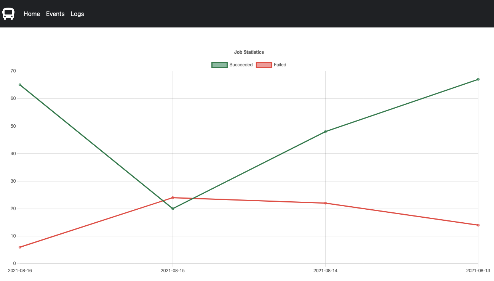
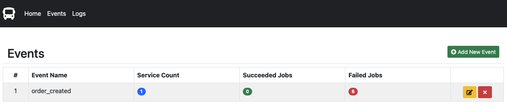
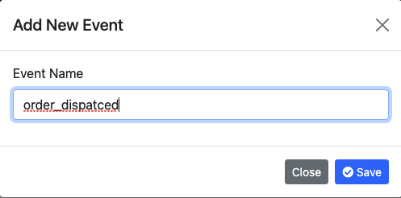
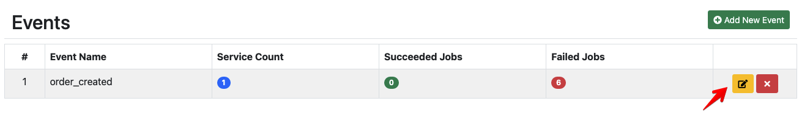
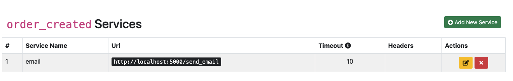
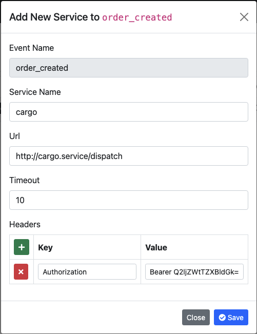

# Dashboard

## Home
This page contains a graph of success and fail messages processed daily.

 

## Events
### List Created Events
In this page, you can do following actions:
- List events
- Display bound services count, succeeded job count and failed job count
- Create a new event
- Remove an event
- Add a new service to event

 

### Create an Event
You can click `Add New Event` button to create a new event.

 

### Service Operations
#### Add a New Service to Event
- Firstly, you can click `edit` button on event.

 

- Then, you can click `Add New Service` button to open a new service form.

 

- Finally, fill the inputs and click `Save` button.

 

#### Update Service
#### Remove Service
### Delete an Event

## Logs
### Filter Logs
### Show Logs Details