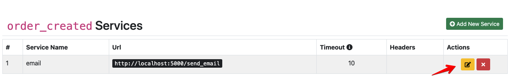
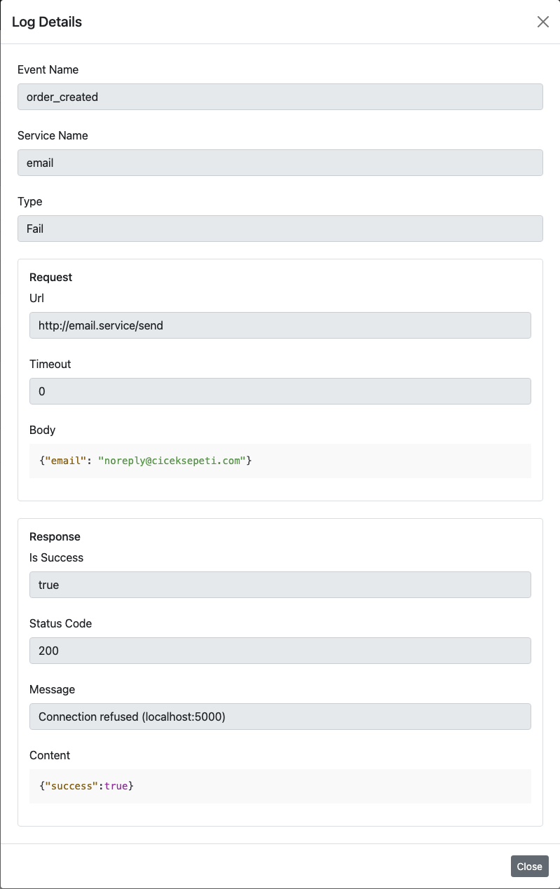

# Dashboard

## Home
This page contains a graph of success and fail messages processed daily.

 

## Events
### List Created Events
In this page, you can do following actions:
- List events
- Display bound services count, succeeded job count and failed job count
- Create a new event
- Remove an event
- Add a new service to event

 

### Create an Event
You can click `Add New Event` button to create a new event.

 

### Service Operations
#### Add a New Service to Event
- Firstly, you can click `edit` button on event.

 

- Then, you can click `Add New Service` button to open a new service form.

 

- Finally, fill the fields and click `Save` button.

 

#### Update Service

Öncelikle servis listesinde bulunan servis güncelle düğmesine tıklayın.
Ardından güncellemek istediğiniz alanları değiştirin.
En son olarak kaydet düğmesine basarak değişiklikleri kaydedin.

- Firstly, you can click `Update Service` button to open update service form.

 

- Then change the fields you want to update.

 

- Finally, save the changes by pressing the `Save` button.

#### Remove Service

- You can click `Remove Service` button.
  
 

- Then, confirm remove service process.

 

### Remove an Event

- You can click `Remove Event` button.
  
 

- Then, confirm remove event process.

 

## Logs
### Filter Logs

You can select or fill fields to filter logs. Then, click `Search` button.

 

You will see paged results on below table.

 

### Show Logs Details

- Firstly, filter logs.
- Then, expand by clicking `Log Details` button.

 

- Finally, you will see log details on popup.

 
