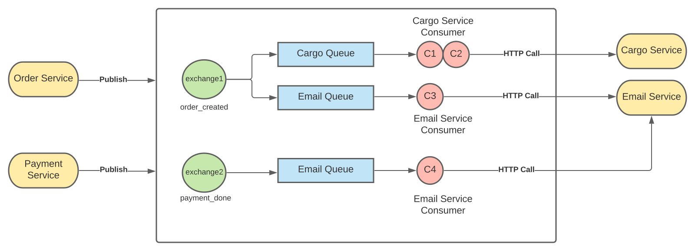
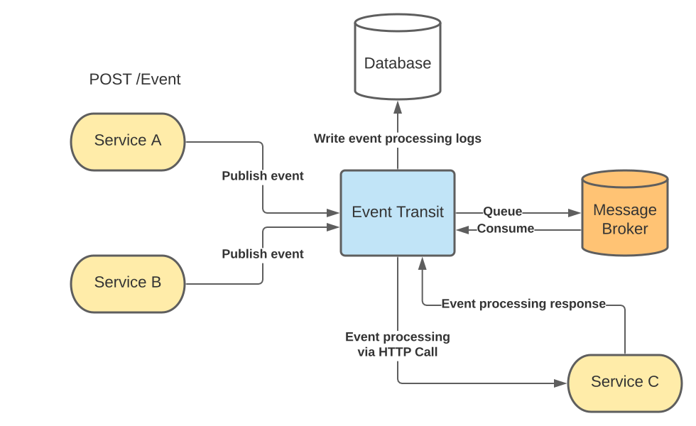
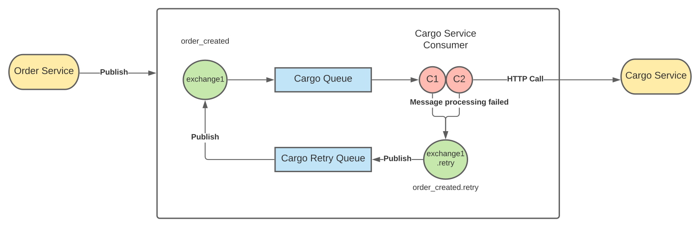

# EvenTransit

EvenTransit is a solution which transfers events into relevant service(s) in a distributed way. Distributed messages handled by built in RabbitMQ implementation.

## Highlights
- Language agnostic way to implement distributed messaging. Best fit for microservices.
- Everything is a simple HTTP request.
- Super easy configuration.
- Connection and channel management.
- Failure management. (Retry logic.)
- Fully compatible with containerized environments such as Kubernetes.

## Message Processing Mechanism

An event is published into EvenTransit service. EvenTransit transfers published message into event's exchange. This exchange delivers message to all bound queues. Each queue consumers make HTTP call with message to external services.

 

### System Architecture

 

## Retry Mechanism

Retry mechanism is involved occurence of an error from external services. Delivered message is transferred into retry exchange and queue. The message waits 30 sec before it republishes. EvenTransit tries message to publish 5 times. Each HTTP call is logged into database.

> Used Dead Letter Exchange and Dead Letter Queue patterns

